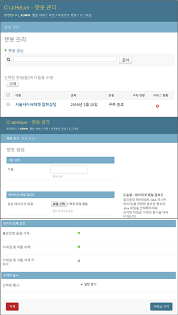

# ChatHelper

**2018년도 Hi-AI & Computing 연구센터 창의/자율과제 차다은, 황태선, 양기수 팀 최종 결과물**

**[Demo 사이트](http://nlplab.iptime.org:32283/)**



ChatHelper는 챗봇 기술과 자연어 처리 기술에 익숙하지 않은 일반 사용자들이 이미 보유한 데이터로부터 쉽게 챗봇을 구축하고 서비스를 제공할 수 있도록 돕는 도구입니다.

기계학습 전문 인력과 대량의 데이터가 없어도, 예상 질문과 답변을 직접 설계하지 않아도 ChatHelper와 함께 당신만의 챗봇을 만들 수 있습니다!

다음의 방법들을 통해서, ChatHelper는 몇 번의 클릭만으로 당신의 데이터로부터 자동으로 챗봇을 구축합니다. Q&A 게시판 데이터와 같이 복잡한 데이터도 자동으로 처리할 수 있습니다.

챗봇 서비스를 이용하는 질문자는 빠르게 자신이 원하는 답변을 얻고, 제공된 기존 질의응답 데이터의 전체 내용과 날짜를 확인하여 원하는 정보에 쉽고 빠르게 접근할 것입니다.

Based on [Django](https://www.djangoproject.com/); Service interface based on [Chat Interface Concept by Emil Carlsson](https://codepen.io/emilcarlsson/pen/ZOQZaV)

## 전처리 과정

전처리 과정에서는 특정 형식으로 입력받은 질의응답 데이터를 챗봇 기술에 적용할 수 있도록 텍스트를 정제합니다.

### 데이터 분할

보유한 질의응답 데이터셋이 채팅 데이터셋이 아니라면 챗봇을 어떻게 구축할 수 있을까요? 예를 들어, 하나의 질의응답 데이터에 여러 질문 내용과 답변 내용이 섞여 있다면 인간이 직접 이를 분리해야 할까요?

ChatHelper에서는 제공된 원본 데이터셋의 텍스트를 문장, 줄바꿈, 문단 단위로 분할하여 사용합니다. 이에 따라 챗봇 데이터가 아닌 다른 질의응답 데이터에서도 챗봇을 자동으로 구축할 수 있습니다.

챗봇 생성 페이지의 도움말을 읽은 뒤, 데이터의 특징을 생각해보고, 적절한 분할 단위를 선택하세요! 나머지는 ChatHelper가 자동으로 처리합니다.

###데이터 정제

보유한 데이터에는 챗봇 기술을 적용하기 전에 정제되어야 하는 부분들이 포함되어 있을 수 있습니다. ㅠㅠ, ㅋㅋ 등의 문자들은 챗봇 기술이 정확한 답변을 선택하는 데에 방해가 될 수 있고, 기존 데이터셋에서의 질문자 닉네임이나 이름은 챗봇 서비스의 답변에 노출되면 안 되겠죠.

이에 따라 ChatHelper는 이러한 텍스트 정제 처리 또한 자동으로 제공합니다.

## 챗봇 기술

ChatHelper의 챗봇 기술은 크게 다음의 3단계로 구성됩니다.

### TextRank 기반 답변 데이터 선별

TextRank 알고리즘은 그래프 기반 ranking을 통해 문서에서 각 문장의 중요도를 계산하는 알고리즘입니다. ChatHelper에서는 TextRank 알고리즘을 이용하여 전체 답변 데이터 중 각 답변 데이터의 중요도를 평가하고, 이에 따라 답변 텍스트에 포함된 인사말 등의 무의미한 답변 데이터들을 제거합니다.

**citation:** Mihalcea, Rada, and Paul Tarau. "Textrank: Bringing order into text." _Proceedings of the 2004 conference on empirical methods in natural language processing._ 2004.

### TF-IDF 유사도 기반 질의응답 데이터 필터링

TF-IDF는 단어들이 특정 문서 내에서 얼마나 중요한지를 나타내는 통계적 수치입니다. 여러 단어의 TF-IDF 값을 특정 문서를 나타내는 특징 벡터로 사용함으로써, 문서 간 유사도를 간단하게 계산할 수 있습니다. ChatHelper에서는 질문자가 입력한 질문과 유사한 기존 질문들을 선택한 뒤, 각 질문들과 일정 수준 이상의 유사도를 갖는 답변들을 가능한 답변 후보로 선택합니다.

### COALA 적용 답변 선택

COALA는 딥러닝 기반 최신 답변 선택 모델로, 주어진 질문과 답변 후보 중 가장 적절한 답변을 선택하는 신경망 모델입니다. COALA는 특히 답변 텍스트의 길이가 길고 학습 데이터의 수가 적은 데이터셋의 처리에 강점을 보입니다. TF-IDF 유사도 기반 방법으로 선택된 답변 후보 중 COALA가 선택한 상위 5개의 답변이 챗봇 서비스에 제공될 것입니다.

**citation:** Rücklė, Moosavi and Gurevych. "COALA: A Neural Coverage-Based Approach for Long Answer Selection with Small Data" _Association for the Advancement of Artificial Intelligence._ 2019.

# 설치 및 실행

ChatHelper는 Ubuntu에서 실행 가능하며, 설치 및 실행은 Ubuntu 16.04 버전에서 테스트되었습니다.

1. ChatHelper의 소스코드를 다운로드 받거나 clone합니다.

    ```
    git clone https://github.com/chadaeun/chathelper.git
    ```

2. `install.sh`를 root 권한으로 실행하여 ChatHelper를 설치합니다.

    ```
    sudo chmod +x install.sh
    sudo ./install.sh
    ```

3. 미리 학습된 GloVe 파일을 아래의 링크에서 다운로드 받아 `chathelper/chatbot_manage/coala/glove` 디렉터리에 넣습니다.

    [pretrained GloVe download](https://drive.google.com/file/d/1se8WBou19LRbAFNcfd2vT555hKRq-XgN/view?usp=sharing)

4. `chathelper` 디렉터리에서 아래의 커맨드를 실행한 뒤, 원하는 관리자 username, 이메일 주소, 비밀번호를 입력하여 관리자 계정을 생성합니다.

    ```
    python manage.py createsuperuser
    ```

5. `run.sh`를 root 권한으로 실행하여 ChatHelper를 실행합니다.

    ```
    sudo chmod +x run.sh
    sudo ./run.sh
    ```
